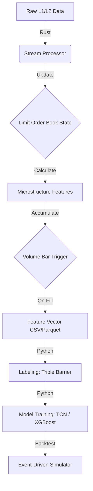

# Project Blueprint: NQ Microstructure-Aware Alpha (Iteration 4)

## 1. Executive Summary
**Goal:** Build a Day Trading AI for NQ (Nasdaq-100) targeting 5-10 minute trends.
**Core Pivot:** Moving from Time-based sampling (Seconds) to Event-based sampling (Volume Bars) to resolve statistical noise. Moving from raw pattern matching to Microstructure Feature Engineering (OFI).
**Data Source:** 3 Years of NinjaTrader L1 (Trades/Quotes) and L2 (Market Depth).

---

## 2. Architecture Overview

## 3. Data Engineering (Rust Preprocessor)

This is the most complex and critical component. It transforms raw ticks into "Alpha-rich" tabular data.

### 3.1. Inputs

Strictly defined based on NinjaTrader exports.

**L1 Record:**

* `Type`: Trade (Last), Bid, Ask.
* `Price`, `Volume`, `Timestamp`.

**L2 Record:**

* `Operation`: Add, Update, Remove.
* `Position`: Order Book Level (0-9).
* `Price`, `Volume` (Size).
* `MarketMaker`: ID.

### 3.2. Sampling Strategy: Volume Bars

We abandon time bars. A new bar is created every `N` contracts traded.

* **Target Volume (`V_target`):** Suggest **500** or **1000** for NQ.
* **Logic:** "Strict Split".
* *Scenario:* Accumulator is at 450. New Trade comes in size 100.
* *Action:*
1. Add 50 to current bar (completing it to 500).
2. **Snapshot Features** and push to output.
3. Start new bar with remaining 50 volume.

* **Why:** Normalizes volatility. Fast markets generate more bars; slow markets generate fewer. The "information density" per bar remains constant.

### 3.3. Feature Engineering (The Alpha)

The Rust processor must maintain a **Local Order Book (LOB)** state (Best Bid/Ask up to Level 10). Features are calculated incrementally or at the time of the bar close.

#### A. Order Flow Imbalance (OFI)

*The primary predictor of short-term price movement.*
For the best Bid () and Ask () and their sizes ():

* **Logic:**
* Bid Price rises  Strong Buying Pressure (+)
* Bid Price constant but Size increases  Buying Support (+)
* (Inverse logic applies to Ask side).

* **Implementation:** Calculate OFI for Level 1, and an aggregated OFI for Levels 1-5. Sum these values over the duration of the Volume Bar.

#### B. Trade Imbalance (VPIN-like)

$$ \text{Imbalance} = \frac{V_{buy} - V_{sell}}{V_{buy} + V_{sell}} $$

* Identify buys vs. sells by comparing `Last` price to the current `Ask` and `Bid`.

#### C. Order Book Shape

* **Depth Ratio:**  (Weighted by distance from price).
* **Sweep Indicator:** Count of L2 `Remove` operations that occur simultaneously with a large L1 trade (identifying aggressive liquidity taking).

---

## 4. Labeling Strategy (Python)

To fix the "Bad Model / Negative Performance" from Iteration 3, we move to dynamic targets.

### 4.1. Triple Barrier Method

For every observation  (Volume Bar), we set three barriers:

1. **Upper Barrier (Profit Take):** 
2. **Lower Barrier (Stop Loss):** 
3. **Vertical Barrier (Time/Expiration):**  (e.g., 50 bars).

### 4.2. Dynamic Volatility ()

* Do **not** use fixed ticks (e.g., 40 ticks).
* Calculate rolling Standard Deviation or ATR of the last 100 Volume Bars.
* **Target:** If volatility is high, the target expands. If low, it contracts.

### 4.3. Class Weights

* Class 1: Hit Upper Barrier first.
* Class -1: Hit Lower Barrier first.
* Class 0: Hit Vertical Barrier (Time out).
* *Note:* If Class 0 dominates >60% of data, widen the vertical barrier or lower the  multiplier.

---

## 5. Model Architecture

Since we have structured tabular data (features) + sequential nature (market history), we use a hybrid approach.

### Option A: TCN (Temporal Convolutional Network) - *Deep Learning Route*

* **Input:** Sequence of last 64 Volume Bars (Features: OFI, Imbalance, Depth, Price Delta).
* **Structure:**
* Causal Convolutions (No looking into the future).
* Dilations [1, 2, 4, 8, 16] to capture long-range dependencies.
* Residual Connections.

* **Output:** Softmax probabilities (Buy, Sell, Hold).

### Option B: Gradient Boosting (XGBoost/CatBoost) - *Tabular Route*

* *Often outperforms Deep Learning on financial tabular data.*
* **Input:** Flattened window of features (e.g., `OFI_current`, `OFI_lag1`, `OFI_lag2`...).
* **Pros:** Handles non-linear relationships in Order Book data extremely well. Easier to interpret feature importance.

---

## 6. Validation & Backtesting

### 6.1. Purged K-Fold Cross Validation

* **Standard K-Fold fails** in finance because trade samples overlap.
* **Purging:** When testing on Fold X, you must delete (purge) the data immediately preceding it in the training set to ensure no label leakage from overlapping Triple Barriers.

### 6.2. Realistic Simulation

To match "Real World" (Iteration 1 failure):

1. **Latency Lag:** In backtest, calculate signal at Bar , but execute trade at Open of Bar  (or even  depending on latency).
2. **Spread Cost:** Always assume execution at the *worst* price (Buy at Ask, Sell at Bid).
3. **Commission:** Deduct standard NQ fees per round trip.

---

## 7. Implementation Roadmap

1. **Rust:** Implement `LOB_Builder` struct to reconstruct book from L2 updates.
2. **Rust:** Implement `VolumeBar_Accumulator` with Strict Split.
3. **Rust:** specific `OFI` calculation function.
4. **Python:** Load processed CSVs. Visual check: Does high OFI correlate with price moves?
5. **Python:** Generate Triple Barrier labels. Check Class Balance.
6. **Python:** Train XGBoost first (baseline). If promising, train TCN.
7. **Backtest:** Run event-driven simulation on out-of-sample data.
